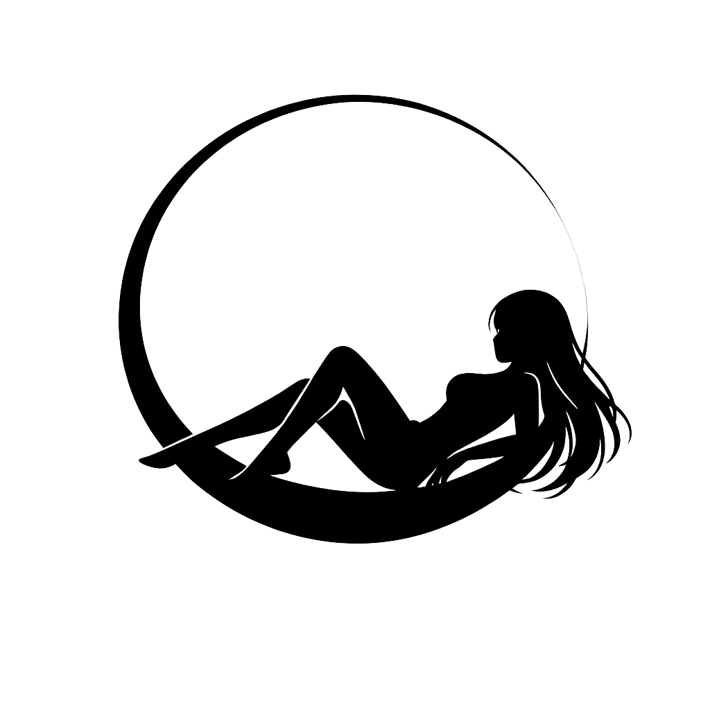

# Selene

<p align="center">
  <picture>
    <source media="(prefers-color-scheme: dark)" srcset="assets/logo-white.png" />
    <source media="(prefers-color-scheme: light)" srcset="assets/logo-dark.png" />
    
  </picture>
</p>

<p align="center">
  <strong>A QML shell for Hyprland, written in Rust.</strong><br />
  The successor to NothingLess. Orbital, translucent, wallpaper-driven.
</p>

---

Selene is the desktop shell that replaces NothingLess. It runs on top of
Hyprland without touching your compositor config: a Rust core speaks
Hyprland IPC and exposes live state to a QML frontend through cxx-qt
bindings. All chrome -- bar, launcher, dashboard, panels, wallpaper
engine -- is QML you can reshape, scripted through a single Lua file.

The name comes from Selene, the Greek goddess of the moon. The visual
language follows: a central moon with status satellites in orbit, lunar
theme presets, and a wallpaper engine that re-tints the whole shell
from your wallpaper.

---

## Install

```bash
curl -sL https://github.com/leriart/selene-shell/raw/main/scripts/install.sh | sh
```

The installer detects the distro (Arch, Fedora, Debian/Ubuntu, NixOS),
pulls build dependencies, clones into `~/.local/src/selene-shell`,
builds in Release, symlinks `scripts/cli.sh` as `~/.local/bin/selene`,
and stages `~/.local/share/selene/` for runtime state. Optionally run
`selene install hyprland` to add a single marked `source =` line to
your Hyprland config.

Manual install:

```bash
git clone https://github.com/leriart/selene-shell
cd selene-shell
cmake -S . -B build -G Ninja -DCMAKE_BUILD_TYPE=Release
cmake --build build
./build/selene-shell
```

Prerequisites: Hyprland, Qt 6.5+ (`qt6-base`, `qt6-declarative`,
`qt6-quick`, `qt6-quickcontrols2`, `qt6-multimedia`, `qt6-network`),
Rust, CMake 3.24+, Ninja. Optional runtime tools: `playerctl`, `cava`,
`pactl`, `nmcli`, `bluetoothctl`, `brightnessctl`, `wf-recorder`,
`wlsunset`, `grim`/`slurp`. `selene doctor` checks the environment.

---

## Usage

```bash
selene                    # launch the shell
selene run <panel>        # open a panel on the running instance
selene reload             # hot-reload QML
selene quit               # stop the shell
selene doctor             # environment diagnostic
selene lock               # lock the session
selene suspend            # suspend the machine
selene record [region]    # start/stop screen recording
selene nightlight         # toggle the night light (wlsunset)
selene dnd                # toggle do-not-disturb
selene caffeine           # toggle idle inhibit
selene profile <name>     # performance | balanced | power-saver
selene brightness <0-100> # set the backlight
selene screenshot [mode]  # screen | region | window
```

`selene run` talks to the live instance over a local socket
(`$XDG_RUNTIME_DIR/selene-shell.sock`) and falls back to launching the
shell with the panel open when no instance is running. Recognised
panels: `launcher`, `dashboard`, `overview`, `powermenu`, `binds`,
`notes`, `todo`, `clipboard`, `notif`, `walls`, `settings`, `audio`,
`net`, `bt`, `picker`, `island`, `metrics`, `weather`, `gamemode`,
`focusmode`, `dnd`, `caffeine`, `nightlight`, `record`, `lock`,
`suspend`.

### Keybinds

The shell ships an Ambxst-style bind set. The installer writes
`hyprland.conf` (or `hyprland.lua`) under `~/.local/share/selene/`;
each bind is a `selene --send ...` IPC to the running instance so
Hyprland consumes the keypress before any focused client sees it.

| Keybind             | Action                       |
|---------------------|------------------------------|
| `SUPER`             | Toggle the launcher          |
| `SUPER + Space`     | Toggle the launcher          |
| `SUPER + D`         | Dashboard                    |
| `SUPER + A`         | Settings                     |
| `SUPER + L`         | Lock the session             |
| `SUPER + V`         | Clipboard history            |
| `SUPER + .`         | Color picker                 |
| `SUPER + N`         | Notes                        |
| `SUPER + T`         | Todo board                   |
| `SUPER + K`         | Keybinds cheatsheet          |
| `SUPER + Return`     | Embedded terminal            |
| `SUPER + Tab` / `\`| Overview                      |
| `SUPER + Escape`    | Power menu                   |
| `SUPER + Pause`     | Caffeine (idle inhibit)      |
| `SUPER SHIFT + R`   | Hot-reload the shell         |
| `SUPER SHIFT + B`   | Cycle power profile          |
| `SUPER SHIFT + N`   | Toggle do-not-disturb        |
| `SUPER SHIFT + P`   | Toggle caffeine              |
| `SUPER SHIFT + Esc` | Quit the shell               |
| `Ctrl+Alt+Left/Right`| Previous / next wallpaper   |

---

## Surfaces

### Always visible

- **Bar** -- floating pill at the top: logo, workspace dots, active
  window title, media, weather, clock, power profile, battery. The
  logo flips between dark and light variants based on the live surface
  luminance.
- **Moon island** (bottom-right) -- the orbital signature: a central
  moon with four status satellites (media, battery, network, CPU) in
  slow orbit. Clicking expands it into a card with media controls,
  CPU/RAM, battery and weather. Notification pulses ripple outward
  from the moon.
- **Dock** (bottom-center) -- the eight most-launched apps, with
  backdrop blur.

### On demand

- **Launcher** -- fuzzy app search ranked by usage, with prefixes:
  `@` apps, `>` actions, `=` calculator, `?` web search, `:` emoji
  picker, plus `timer 5m`, `stats`, `weather [city]`, `help`, `lock`.
  Running timers surface in the launcher and can be cancelled there.
- **Dashboard** -- four tabs: Controls (volume, brightness, Wi-Fi,
  Bluetooth, power profile, game/focus mode, DND, caffeine, night
  light, recording), Metrics (CPU/RAM/GPU/disk), Wallpapers, Weather.
- **Overview** -- live workspace grid driven by Hyprland IPC.
- **Notification center** -- D-Bus daemon implementing
  `org.freedesktop.Notifications` with action buttons, DND and history.
- **Wallpaper picker** -- thumbnail grid over your wallpaper directory.
  Images, GIF/APNG and video wallpapers all render natively.
- **Power menu** -- lock, log out, suspend, reboot, power off.
- **Notes** -- quick notes persisted to
  `~/.local/share/selene/notes.json`.
- **Todo board** -- three-column kanban persisted to
  `~/.local/share/selene/todo.json`.
- **Keybinds** -- cheatsheet rendered from the `binds` list in
  `init.lua`.
- **Quick settings** -- Audio (pactl), Network (nmcli), Bluetooth
  (bluetoothctl), each as a slide-over panel.
- **Sidebar** (left edge) -- thin rail with quick toggles and status
  badges.
- **Lock screen** -- in-shell lock with PAM authentication.

### System feedback

Volume, brightness, night light and recording changes flash a circular
OSD popup in the centre of the screen. Every panel and toggle speaks
to real subprocesses (`pactl`, `nmcli`, `bluetoothctl`, `brightnessctl`,
`wlsunset`, `wf-recorder`, `grim`) through Rust backends.

---

## Wallpaper engine

The wallpaper engine is native: Rust enumerates the directory, caches
thumbnails, extracts a live palette from the current image, and hands
rendering to Qt. Videos decode through hardware acceleration when
available (`h264_qsv` / `h264_vaapi` / `h264_nvenc`), are downscaled
into `~/.cache/selene/video-cache` for 4K sources, and pause decoding
while the screen is locked or game mode is active.

Drop your wallpapers into the `wallpapers/` folder of this repository,
or set `SELENE_WALLPAPER_DIR` to any directory.

---

## Configuration

One file: `~/.config/selene/init.lua`. It is hot-reloaded with inotify
and round-trips through the Settings panel.

```lua
return {
    panel = {
        height      = 36,
        position    = "top",
        transparent = true,
        modules     = { "workspaces", "clock", "tray", "island" },
    },
    launcher = {
        width       = 640,
        max_results = 8,
        show_icons  = true,
    },
    theme = {
        accent     = "#a78bfa",
        background = "#1a1b1e",
        surface    = "#2a2b2e",
        preset     = "default",        -- new-moon | waxing-crescent
                                       -- first-quarter | full-moon
                                       -- sunset | midnight | monochrome
        animation_profile = "m3",      -- m3 | subtle | bouncy | off
        follow_wallpaper  = true,
    },
    font = { family = "Inter", size = 13 },
    binds = { "SUPER -> launcher", "SUPER + D -> dashboard" },
}
```

Presets re-tint every token (background, surface, border, accent,
text, halo) with an animated transition. The palette engine extracts
colours from the wallpaper and pushes them into the same tokens; when
`follow_wallpaper` is off or a non-default preset is active, the
palette stays out of the way.

---

## Building from source

```bash
cmake -B build -S . -G Ninja -DCMAKE_BUILD_TYPE=Release
cmake --build build
```

Headless smoke test (no Wayland session required):

```bash
QT_QPA_PLATFORM=offscreen build/selene-shell \
    --screenshot /tmp/selene.png --delay 4000
```

`--show <panel>` opens a surface before capture, `--preset <name>` and
`--anim-profile <name>` apply theme and animation profiles for the
shot, and `--size WxH` sets the render size.

---

## Architecture

```
                          QML Layer
 +-------------------------------------------------------+
 | Bar  Launcher  Dashboard  Overview  Panels  LockScreen |
 +-----------------------+--------------------------------+
                         |
                         | QtQuick / QQmlApplicationEngine
                         |
 +-----------------------+--------------------------------+
 |                    Rust Backend (cxx-qt)                |
 |                                                         |
 | Hyprland IPC  Lua config  Wallpaper engine  Palette     |
 | Spawner  Notifier  Audio  Network  Bluetooth  System    |
 | Weather  Brightness  Power profile  Notes  Todo  ...    |
 +---------------------------------------------------------+
                         |
                         | subprocesses
                         v
```

The Rust crate builds a single `staticlib`; CMake links it into the
`selene-shell` executable. QML files ship inside the binary through
`qrc`, so the shell runs with no filesystem dependency on its assets.
Blocking work (subprocess polling, D-Bus, video decoding) lives on
dedicated threads and reports back to the Qt main thread through the
cxx-qt queued bridge.

The live IPC socket accepts one command per connection: `show <panel>`,
`apply-preset <name>`, `animation-profile <name>`, `osd <kind> <value>`,
`reload`, `quit`.

---

## Contributing

Issues and pull requests are welcome. Read `AGENTS.md` first: it
documents the build flow, how to add a QObject or a QML component,
threading rules, and the do/don't list of the cxx-qt bridge.

---

## License

Apache 2.0 -- see [LICENSE](LICENSE).

Selene is the successor to [NothingLess](https://github.com/leriart/NothingLess).
